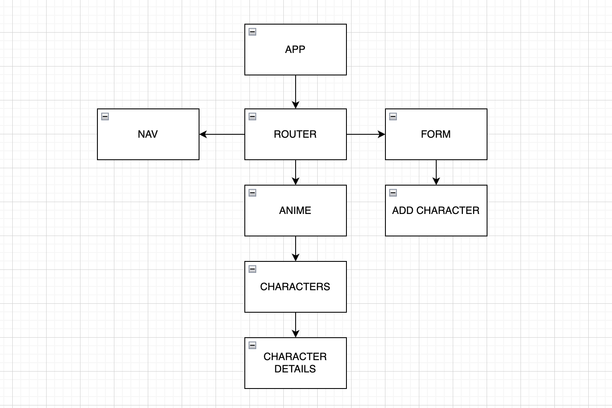

# Anime Picks

<!--  -->

## Date: 12/07/22

### By:

#### Thomalita Burbank [GitHub](https://github.com/thomalita) | [LinkedIn](https://www.linkedin.com/in/thomalita-burbank/) | [Deployed Site](https://anime-picks-frontend.herokuapp.com/)

---

### **_Resources_**

[Backend Repo](https://github.com/thomalita/tomtom)

---

### **_Description_**

A Webapp that brings some of the most popular Anime Characters from shows many people love. Will show a detail page of their story and will include pictures.  

---

### **_Technologies Used_**

#### PERN Stack

- React
- Postgres
- HTML
- Node.js
- JavaScript
- CSS

### **_Getting Started_**

- cd client
- npm install
- npm install react-router-dom
- npm install axios
- npm run start
---
### **_Screenshots_**

#### **_Component Heirarchy Diagram:_**

#### **_Login Page_**

#### **_Anime Page_**

### **_Planning_**

#### [Anime Picks Trello Board](https://trello.com/c/sZIkGFng/1-anime-picks)

---
#### Credits
##### [Google](www.google.com)
##### [Wikipedia](https://en.wikipedia.org/wiki/Attack_on_Titan)
##### [Fandom](https://www.fandom.com/)
---

### **_License_**

MIT License

###### Copyright &copy; 2022 Thomalita Burbank